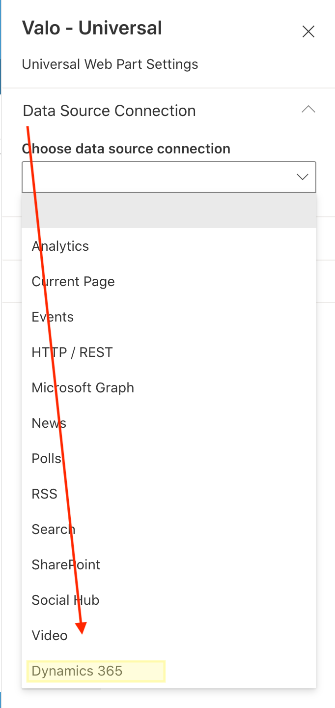
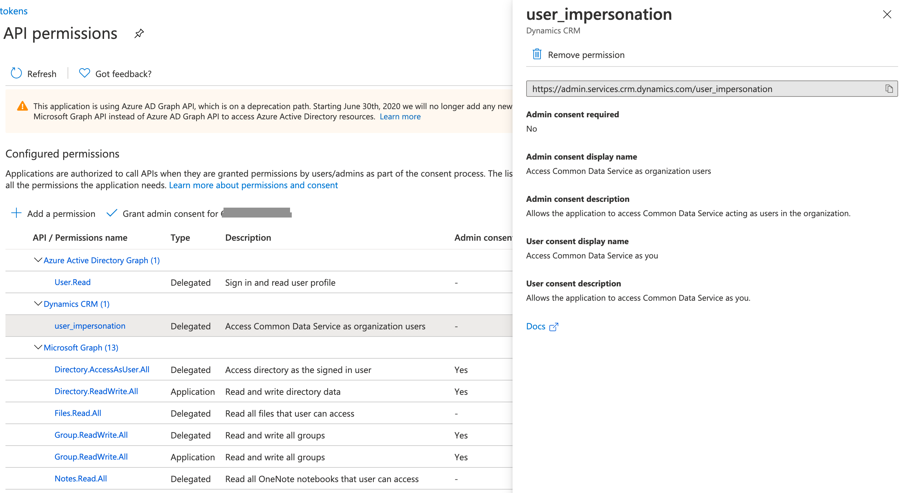

# Valo Custom Data Source - Dynamics 365

## Summary

This extension to the Valo Universal Web Part demonstrates the ability to connect to Dynamics 365 data.

## Used SharePoint Framework Version

## Applies to

- [SharePoint Framework](https://aka.ms/spfx)
- [Microsoft 365 tenant](https://docs.microsoft.com/en-us/sharepoint/dev/spfx/set-up-your-developer-tenant)

> Get your own free development tenant by subscribing to [Microsoft 365 developer program](http://aka.ms/o365devprogram)

## Prerequisites

* Target Microsoft 365 tenant must first have Valo Modern installed
* The Valo Modern app registration in the target environment must be configured to allow delegated API permissions to the Dynamics CRM (Common Data Service) API

Once this solution is added to the SharePoint app catalog, a new data source is available in the Valo Universal Web Part.

## Solution

Solution|Author(s)
--------|---------
valo-datasource-dynamics | Mark Powney, Valo [@mpowney](https://twitter.com/mpowney)

## Version history

Version|Date|Comments
-------|----|--------
0.0.1|September 7, 2020|Initial release

## Disclaimer

**THIS CODE IS PROVIDED *AS IS* WITHOUT WARRANTY OF ANY KIND, EITHER EXPRESS OR IMPLIED, INCLUDING ANY IMPLIED WARRANTIES OF FITNESS FOR A PARTICULAR PURPOSE, MERCHANTABILITY, OR NON-INFRINGEMENT.**

---

## Minimal Path to Awesome

- Clone this repository
- Ensure that you are at the solution folder
- in the command-line run:
  - **npm install**
  - **gulp serve**

## Features

This solution allows page authors and site owners to connect the Valo Universal Web Part to Dynamics 365 Customer Experience data.

For this solution to work, the target environment must first be configured to securely enable access from the Valo modern site to Dynamics 365 APIs.  The Valo Tokens app, found in the App Registrations of Azure Active Directory, must have the **Dynamics CRM** delegate permission added, and admin consent must then be granted.

After the solution is deployed, a new data source is offered in the Universal Web Part properties.  Once selected, the data source accepts an API URL from the [Dynamics Customer Engagement Web API](https://docs.microsoft.com/en-us/dynamics365/customer-engagement/web-api/about?view=dynamics-ce-odata-9)

This extension provides the following capability:

- Authentication to Dynamics 365 CRM Common Data Service via Azure Active Directory
- A new data source for Valo Universal Web Part templates, to leverage the Dynamice 365 Common Data Service

## References

- [Use the Common Data Service Web API](https://docs.microsoft.com/en-us/powerapps/developer/common-data-service/webapi/overview)
- [Getting started with SharePoint Framework](https://docs.microsoft.com/en-us/sharepoint/dev/spfx/set-up-your-developer-tenant)
- [Microsoft 365 Patterns and Practices](https://aka.ms/m365pnp) - Guidance, tooling, samples and open-source controls for your Microsoft 365 development
